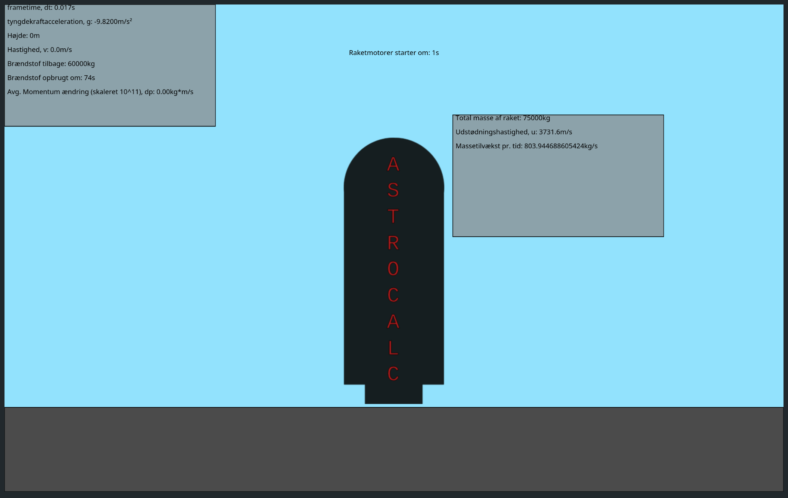

Public instance: https://casdnas.duckdns.org/astrocalc/calculators/rocketlaunch/rocketlaunch.html

# What is this?
This is a website with a simple simulation using p5js of a rocket launch. 
One can select a rocket engine from a list or manually type data into the input field and simulate it.
The simulation is very simple so there isn't any air resistance etc. More info is written on the simulation page.

# Examples

Raptor thruster launch test


## How to use
Basically it can't be opened from the filebrowser because of p5.js, see https://github.com/processing/p5.js/wiki/Local-server
It needs to be hosted on a webserver, where the root is /public directory. Below is an nginx config where the website is hosted in `astrocalc` sub dir:

```
location /astrocalc {
	alias /path/to/astrocalc/public/;
	try_files $uri $uri/ $uri.html =404;
}
```

Substitue the `/path/to` to the path where the website is located.

## TODO
* calc final accel when fuel spent and show in html
* nav-bar
* calculator button css
* birds flying in atmos
* stars
* buildings
* crash screen if rocket crashes
* air resistance
